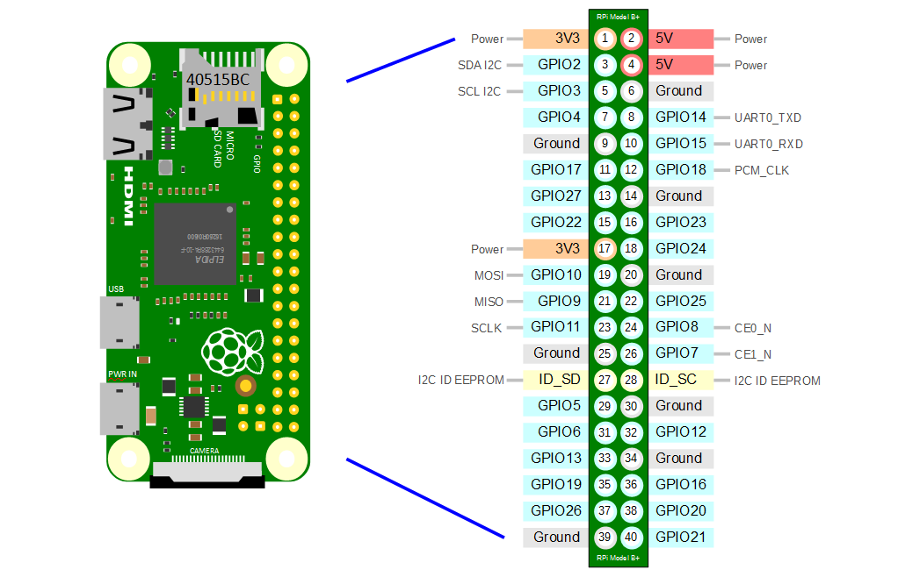
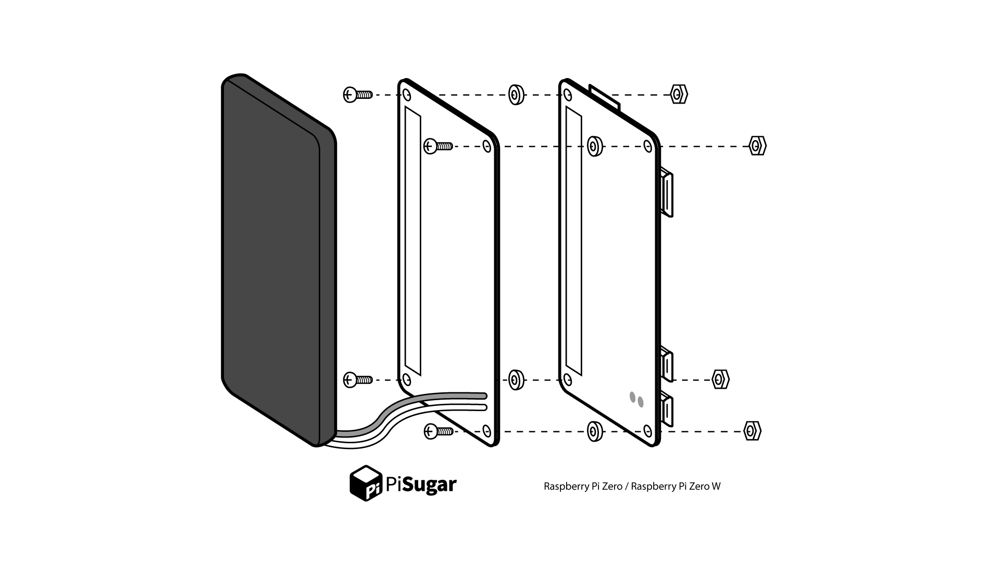
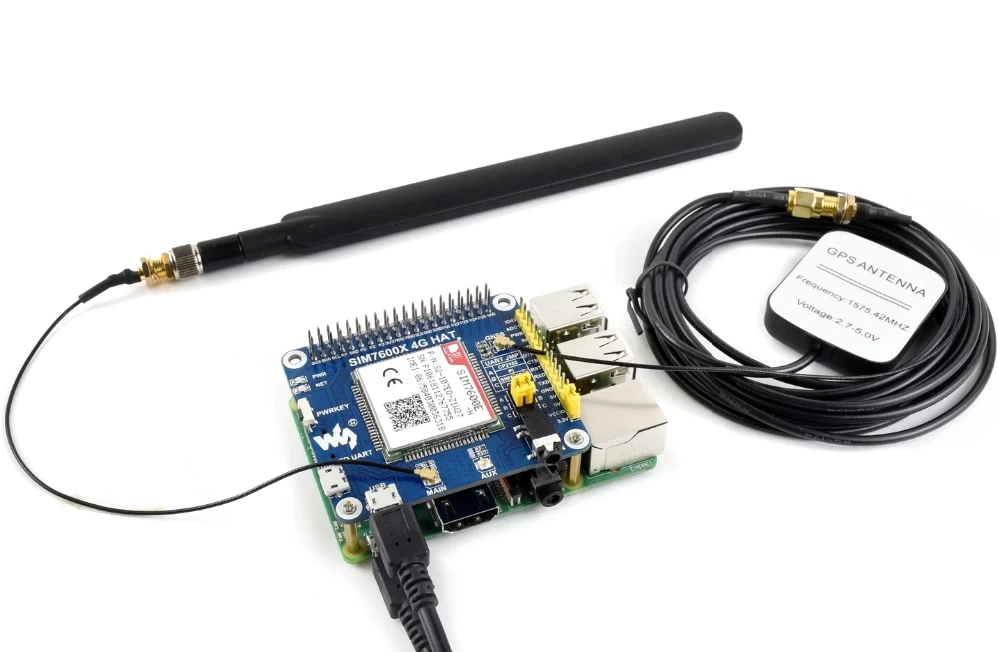
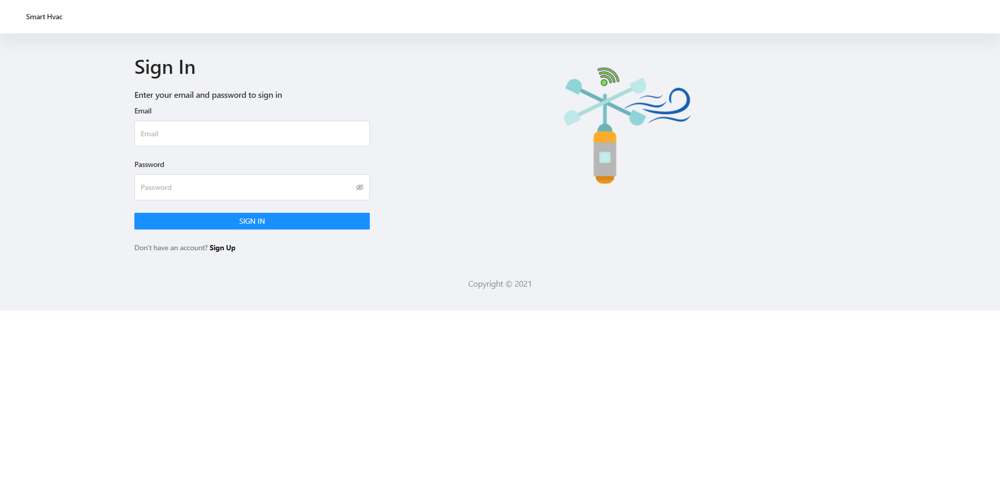
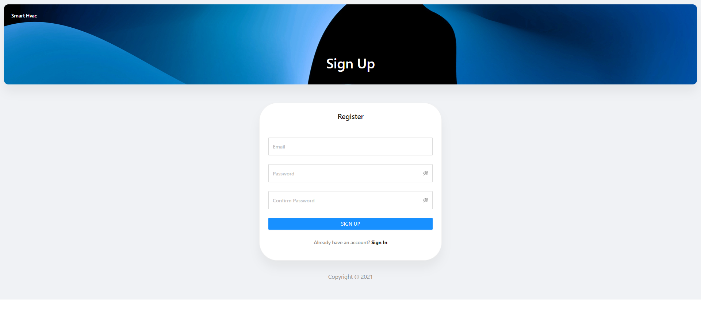
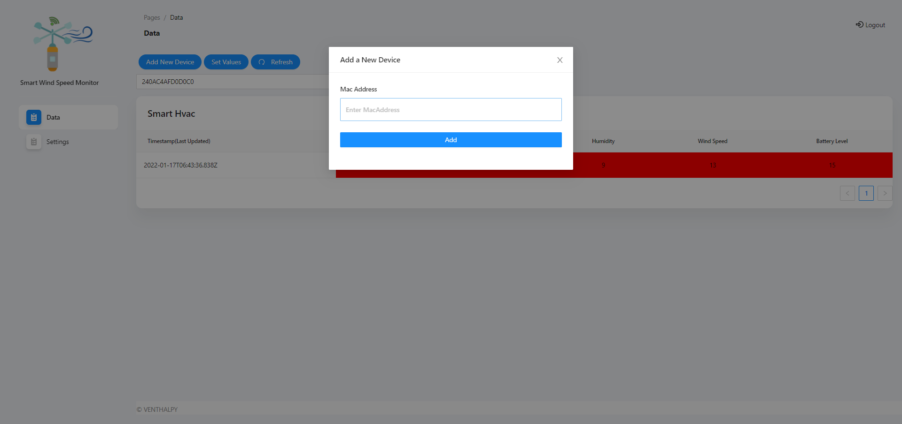
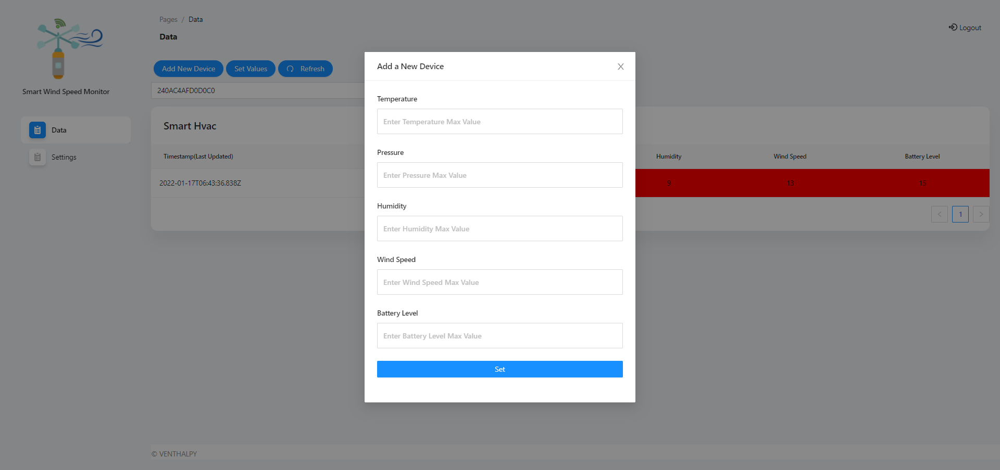
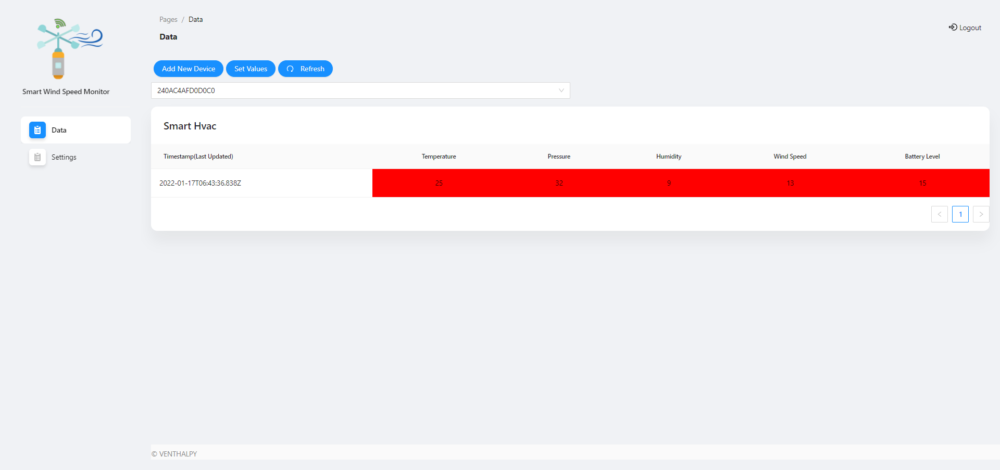
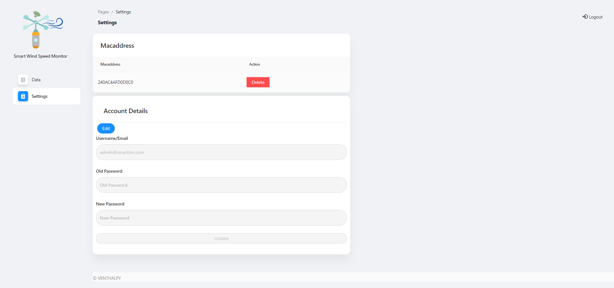

<p align="center">
  <a href="" rel="noopener">
 </a>
</p>

<h3 align="center">Smart Wind Speed Monitor</h3>

<div align="center">

[]()

</div>

---

<p align="center"> Smart Wind Speed Monitor
    <br> 
</p>

## 📝 Table of Contents

- [About](#about)
- [Getting Started](#getting_started)
- [Circuit](#circuit)
- [WebApp](#webapp)
- [Usage](#usage)
- [List Of Components](#list)
- [Built Using](#built_using)
- [Authors](#authors)

## 🧐 About <a name = "about"></a>

This repo contains

- Backend
- Firmware
- Detailed instructions

for Smart Wind Speed Monitor.

## Getting Started <a name = "getting_started"></a>

These instructions will get you a copy of the project up and running on your system.

### Prerequisites

Things you need to install the FW.

```
- Raspberry Pi Zero W
- PiSugar
- SIM7600-X
```

### Installing <a name = "installing"></a>

A step by step series that tell you how to get the Firmware and Backend running
### Raspberry Pi Firmware Pre-Reqs

1.  Download and install the latest Raspberry Pi OS Desktop image to your SD card
2.  Open the terminal and execute the following command
    ```sudo raspi-config```
3. Then follow the following pictures to enable I2C bus on you raspberry pi

* 
* 
* 
* 
* 

* Then do the same for Serial(UART) and SPI

* 
* 
### Configuring Raspberry Pi

 1.  Copy Firmware folder to the desktop of your Raspberry Pi, open the terminal of your Raspberry Pi and execute the following commands
  - ```sudo apt-get update```
  - ```sudo apt-get upgrade```
  - ```cd ~/Desktop/Firmware/```
  - ```sudo chmod a+rx starter.sh```
  - ```sudo apt install python3-pip```
  - ```sudo pip3 install --upgrade setuptools```
  - ```pip3 install paho-mqtt```
  - ```pip3 pip3 install get-mac```
  - ```sudo pip3 install RPi.bme280```
  - ```pip3 install smbus-cffi==0.5.1```

#### Running the Firmware

-   Execute the following command to run the firmware

``./home/pi/Firmware/starter.sh``

## Circuit <a name = "circuit"></a>

### Raspberry Pi Zero W Pinout

Follow the pinout diagram given below to connect different components to your Raspberry Pi Zero W.



### Pi Sugar Connection with Raspberry Pi Zero W

The Pi Sugar will be placed beneath the Raspberry Pi Zero W as shown in the sketch below.



### Sim7600E Connection with Raspberry Pi Zero W

The Pi Sugar will be placed above the Raspberry Pi Zero W as shown in the pciture below. Moreover, the antennas for GPS and GPRS can be easily connected.




### Complete Circuit Diagram

Here's the complete circuit diagram of the system.


### Components Pin Connection Details

```http
Components pin connection details
```

#### LED Light

```LED Light Connected with Rapberry Pi Zero W```

| LED Pins | Raspberry Pi Zero W |
| :---------- | :---- |
| `Pin 1 (longer pin)`   | `D12` |
| `Pin 2 (shorter pin)`   | `GND` |

#### Buzzer

```Buzzer Connected with Rapberry Pi Zero W```

| Buzzer Pins | Raspberry Pi Zero W |
| :---------- | :---- |
| `Pin 1 (red)`   | `D27` |
| `Pin 2 (black)`   | `GND` |

#### Anemometer

```Anemometer Connected with Rapberry Pi Zero W```

| Anemometer Pins | Raspberry Pi Zero W |
| :---------- | :---- |
| `Pin 1`   | `D5` |
| `Pin 2`   | `GND` |


#### Temperature and Humidity Sensor (BME280)

```BME280 Connected with Rapberry Pi Zero W```

| BME280 Pins | Raspberry Pi Zero W |
| :--------- | :---- |
| `VIN`      | `3.3V`  |
| `GND`      | `GND` |
| `SCL`     | `SCL` |
| `SDA`     | `SDA` |

## WebApp <a name = "webapp"></a>

-   Web App is deployed and accessible from the link below
    -   https://windspeedmonitor-frontend.production.rehanshakir.com/
    -   Email Address: admin@smartsm.com
    -   Password: admin

### Backend

-   Data from ESP32 to Dashboard is published on the topic `wsmdata/macAddress` where macAddress is the MAC Address of the Raspberry Pi.
-   Alarm/warning data is published from the dashboard to the Raspberry Pi on topic `macAddress/wsm`
## Usage <a name = "usage"></a>

1.  Power on your Device and get its MAC Address. You can get the MAC Address as soon as you run the [firmware](https://github.com/Nauman3S/Smart-Wind-Speed-Monitor#running-the-firmware)
2.  Log-in to the dashboard or create a new account


| Log-In | Sign-up |
| :--------- | :---- |
|     |  |

3.  Add a new device with its MAC Address



4.  Set it's alarm values for turning the buzzer on/off


5. Now you can see the real-time data of the device with the alarm values



6.  You can also delete the device or change the user settings from the settings page


## List of Components <a name = "list"></a>

Following components are used to make this project

1.  Raspberry Pi Zero W
    ○ https://www.amazon.co.uk/CanaKit-Raspberry-Wireless-Complete-Starter/dp/B072N3X39J/ref=sr_1_1?keywords=raspberry+pi+zero+w+w&qid=1639821510&sr=8-1
2.  RPi Zero W UPS
    ○ https://www.amazon.co.uk/Pisugar2-Portable-Lithium-Raspberry-Accessories/dp/B08D678XPR/ref=sr_1_4?keywords=raspberry+pi+ups&qid=1639821580&sr=8-4
3.  4G GPRS and GPS SIM7600E-H
    ○ https://www.amazon.co.uk/IBest-GSM-GPRS-GNSS-Board/dp/B07PPSTY13/ref=sr_1_3?keywords=raspberry%2Bpi%2B4g&qid=1639821783&sr=8-3&th=1
4.  BME280 Temperature, Humidity and Pressure Sensor
    ○ https://www.amazon.co.uk/CUQI-Barometric-Pressure-Temperature-Humidity/dp/B0991RKZSN/ref=sr_1_1?keywords=bme280&qid=1639822215&sr=8-1
5.  Wind Speed Meter
    ○ https://www.amazon.co.uk/Nephit-Measurement-Meteorological-Instruments-Accessories/dp/B09F64GXQH/ref=sr_1_7?keywords=wind+speed+sensor&qid=1639822540&sr=8-7
6.  RJ11 Screw Terminal
    ○ https://www.amazon.co.uk/JENOR-Terminal-Adapter-Connector-Splitter/dp/B087R3187F/ref=sr_1_2?keywords=rj11+terminal&qid=1639823304&sr=8-2
7.  RJ11 Connector
    ○ https://www.amazon.co.uk/Rhinocables%C2%AE-Coupler-Extender-Extension-connector/dp/B00EVS92KQ/ref=sr_1_3?keywords=rj11+connector&qid=1639823380&sr=8-3
8.  Alarm Buzzer
    ○ https://www.amazon.co.uk/sourcingmap%C2%AE-Continuons-Electronic-Buzzer-Sounder/dp/B010V4UZTK/ref=sr_1_9?keywords=alarm+buzzer&qid=1639823529&sr=8-9
9.  3v-6v LED
    ○ https://www.amazon.co.uk/Sourcingmap-20pcs-Wired-Light-Flashing/dp/B07DYZ1L3Y/ref=sr_1_12?keywords=led+light+5mm&qid=1639823838&sr=8-12

## 📽️Demo Videos <a name="demovideo"></a>

-   [Firmware Demo Video](https://youtu.be/ptCAPFGeyw8) - Smart Wind Speed Monitor Firmware Demo Video
## ⛏️ Built Using <a name = "built_using"></a>


- [Python](https://www.python.org/) - Programming Language - For Raspberry Pi Zero W Firmware
- [Fritzing](https://fritzing.org/) - Circuit Designer

## ✍️ Authors <a name = "authors"></a>

- [@Nauman3S](https://github.com/Nauman3S) - Development and Deployment
